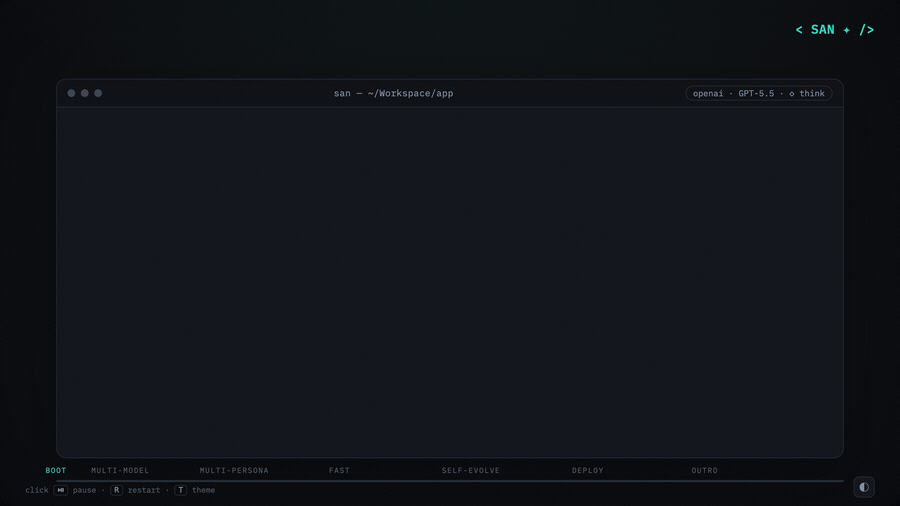

<div align="center">
  <h1>&lt; SAN ✦ /&gt;</h1>
  <p><strong>An open, ~12 MB runtime for fast AI agents</strong></p>
  <p>
    <a href="https://github.com/genai-io/san/releases"></a>
    <a href="https://goreportcard.com/report/github.com/genai-io/san"></a>
    <a href="https://genai-io.github.io/san/"></a>
    <a href="https://genai-io.github.io/san/getting-started.html"></a>
    <a href="docs/index.md"></a>
    <a href="https://www.producthunt.com/products/san?launch=san"></a>
    <a href="LICENSE"></a>
  </p>
  <p>
    <strong>English</strong> · <a href="README.zh.md">简体中文</a>
  </p>
  <p>
    <a href="https://genai-io.github.io/san/intro.html"></a>
  </p>
  <sub><a href="https://genai-io.github.io/san/intro.html">Open the full-quality intro ↗</a></sub>
  <p>
    ⚡ <strong>~0.01s</strong> cold start&nbsp;&nbsp;·&nbsp;&nbsp;📦 <strong>~12 MB</strong> single binary&nbsp;&nbsp;·&nbsp;&nbsp;🪶 <strong>zero</strong> runtime deps — no Node.js, no Python
  </p>
</div>

San is a terminal-native **unified runtime for specialized agents** — coding and beyond. Plug in any model and search backend, switch personas, and run your skills, plugins, MCP servers, and subagents unmodified. And it's self-evolving, learning as you work. One Go binary, runs anywhere.

<sub>*The name — **San**, written **三** ("three") and drawn **☰**. From the Dao De Jing, 三生万物 — "three begets the ten-thousand things": one runtime that becomes any agent, running a three-step loop (reason → act → observe). The command stays `san`.*</sub>

## Features

<details>
<summary><b>Open architecture</b> &nbsp;→&nbsp; overview diagram</summary>

<div align="center">
  
</div>

</details>

- **LLM providers** — Anthropic, OpenAI, Google, DeepSeek, Moonshot, Alibaba, MiniMax, Z.ai (GLM), SenseNova, Mimo, Volcengine (Ark), Ollama (local), Agnes-AI; swap via `/model`.
- **Search backends** — Exa, Tavily, Brave, Serper; swap via `/search`.
- **Personas** — Markdown identities scoped to user or project; swap via `/identity` ([details](docs/concepts/harness-channels.md#identity-custom-personas)).
- **Skills & extensions** — Claude Code skills, plugins, and MCP servers run unmodified; sandboxed subagents; lifecycle hooks (shell, LLM, agent, HTTP); auto-loaded project memory.
- **Self-evolving** — every few turns a background reviewer distills your recent work into durable memory and reusable skills, so the agent levels up as you work. *(Level 1 available; deeper levels on the way.)*

### Engineering

- **Runs anywhere** — A single ~12 MB binary, zero runtime dependencies (no Node.js, no Python). Native Go: ~0.01s cold start, ~32 MB baseline; the same file runs unchanged on a laptop, an edge device, or a `scratch` container. Windows, macOS, and Linux builds in release artifacts ([footprint](docs/operations/footprint.md) · [benchmark](#benchmark-san-vs-claude-code)).
- **Permission system** — Mode-based access control: ask (default) and auto-accept, toggled with `Shift+Tab`. Subagents inherit permission gates for sandboxed execution ([details](docs/concepts/permission-model.md)).
- **Event-driven coordination** — Parallel subagents via a pub/sub hub ([architecture](docs/packages/subagent.md)).
- **Session persistence** — Auto-save, resume (`--continue`, `--resume`), fork (`/fork`), and automatic context compaction (`/compact`).
- **Cost tracking** — Per-message and per-session token costs across all providers.
- **Theme & appearance** — Switch TUI color themes via the `/config` Appearance panel; "auto" matches your terminal.
- **Prompt prediction** — Speculative completion of likely next prompts to cut latency.
- **Session inspector** — Local web UI for transcript replay, system-prompt forensics, and live-tail of active sessions (`san inspector`).


## Installation

**macOS / Linux**

```bash
curl -fsSL https://raw.githubusercontent.com/genai-io/san/main/install.sh | bash
```

**Windows (PowerShell)**

```powershell
irm https://raw.githubusercontent.com/genai-io/san/main/install.ps1 | iex
```

Re-run to upgrade.

<details>
<summary><b>Other methods</b></summary>

**Uninstall**

```bash
# macOS / Linux
curl -fsSL https://raw.githubusercontent.com/genai-io/san/main/install.sh | bash -s uninstall
```

```powershell
# Windows (PowerShell)
& ([scriptblock]::Create((irm https://raw.githubusercontent.com/genai-io/san/main/install.ps1))) uninstall
```

**Go Install**

```bash
go install github.com/genai-io/san/cmd/san@latest
```

**Build from Source**

```bash
git clone https://github.com/genai-io/san.git
cd san
go build -o san ./cmd/san
mkdir -p ~/.local/bin && mv san ~/.local/bin/
```

</details>

## Usage

```bash
san                              # interactive
san "explain this function"      # one-shot
san -p "do something"            # print mode (no TUI), pipe-friendly
san --continue                   # resume the latest session
san --resume                     # pick a past session to resume

# Subcommands (run `san <command> --help` for the full list)
san inspector                    # session transcript viewer
san agent run --type Explore --prompt "..."   # run a headless agent
san plugin <list|install|enable|...>          # manage plugins
san mcp <add|list|remove|...>                 # manage MCP servers
```

| What | How |
|---|---|
| Pick / switch model | `/model` — saved to `~/.san/providers.json` |
| Cycle thinking budget | `Ctrl+T` or `/think` (levels vary by provider) |
| Toggle permission mode | `Shift+Tab` (ask · auto-accept) |
| Search / identity / memory | `/search` · `/identity` · `/memory` |
| Skills / agents / tools | `/skills` · `/agents` · `/tools` |
| Plugins / MCP / config | `/plugin` · `/mcp` · `/config` |
| Session / loop / misc | `/fork` · `/compact` · `/loop` · `/glob` · `/init` · `/clear` |
| All slash commands | `/help` |
| Send · newline · stop | `Enter` · `Alt+Enter` · `Esc` |
| Expand tool · cancel · exit | `Ctrl+O` · `Ctrl+C` · `Ctrl+D` |

For API keys, set the matching env var (see Credentials below) or paste when prompted on first launch. Full walkthrough: [`docs/guides/getting-started.md`](docs/guides/getting-started.md).

### Configuration

Config lives in `~/.san/` (user) and `<project>/.san/` (project, overrides user). A `SAN.md` or `CLAUDE.md` at the project root is auto-loaded into the system prompt.

<details>
<summary><b>Credentials</b></summary>

| Service | Variable |
|:--------|:---------|
| **Anthropic** (Claude) | `ANTHROPIC_API_KEY` or [Vertex AI](https://cloud.google.com/vertex-ai/generative-ai/docs/partner-models/claude) |
| **OpenAI** (GPT, o-series, Codex) | `OPENAI_API_KEY` |
| **Google** (Gemini) | `GOOGLE_API_KEY` |
| **DeepSeek** (DeepSeek V4) | `DEEPSEEK_API_KEY` |
| **Moonshot** (Kimi) | `MOONSHOT_API_KEY` |
| **Alibaba** (Qwen) | `DASHSCOPE_API_KEY` |
| **MiniMax** | `MINIMAX_API_KEY` |
| **Z.ai** (GLM / GLM Coding Plan) | `BIGMODEL_API_KEY` |
| **SenseNova** | `SENSENOVA_API_KEY` |
| **Mimo** | `MIMO_API_KEY` |
| **Volcengine** (Ark) | `VOLCENGINE_API_KEY` |
| **Ollama** (local) | `OLLAMA_BASE_URL` (default `http://localhost:11434/v1`) |
| **Agnes-AI** | `AGNESAI_API_KEY` |
| **Exa** search | _none_ (default) |
| **Tavily** search | `TAVILY_API_KEY` |
| **Brave** search | `BRAVE_API_KEY` |
| **Serper** search | `SERPER_API_KEY` |

</details>

<details>
<summary><b>Directory layout</b></summary>

User-level (`~/.san/`):

```
providers.json    # Provider connections and current model
settings.json     # Permissions, hooks, env, identity
skills.json       # Skill states
identities/       # Custom personas (see /identity)
skills/           # Custom skill definitions
agents/           # Custom agent definitions
commands/         # Custom slash commands
plugins/          # Installed plugins
projects/         # Session transcripts + indexes
```

Project-level (`.san/`):

```
settings.json       # Permissions, hooks, disabled tools
mcp.json            # MCP server definitions (team shared)
mcp.local.json      # MCP server definitions (personal, git-ignored)
identities/*.md     # Project-scoped personas (override user-level)
agents/*.md         # Subagent definitions
skills/*/SKILL.md   # Skills
commands/*.md       # Slash commands
plugins/            # Project-level plugins
plugins-local/      # Local plugins (git-ignored)
```

</details>

## Benchmark: San vs Claude Code

Compared with [Claude Code](https://claude.ai/code) v2.1.112 on Apple Silicon, same model (`claude-sonnet-4-6`):

| Metric | San | Claude Code | Advantage |
|--------|---------|-------------|-----------|
| Download size | 12 MB | 63 MB (+ Node.js 112 MB) | **5x smaller** |
| Disk footprint | 38 MB | 175 MB | **4.6x smaller** |
| Startup time | ~0.01s | ~0.20s | **20x faster** |
| Startup memory | ~32 MB | ~189 MB | **5.8x less** |
| Simple task | ~2.4s / 39 MB | ~10.4s / 286 MB | **4.3x faster, 7.3x less memory** |
| Tool-use task | ~3.3s / 39 MB | ~26.0s / 285 MB | **7.9x faster, 7.2x less memory** |

Both tools have comparable features (hooks, skills, plugins, session, MCP, etc.). The performance gap comes from Go's native compilation, minimal architecture design, and lean prompt engineering — vs Node.js V8/JIT/GC runtime overhead.

See full details: [docs/operations/benchmark.md](docs/operations/benchmark.md)

## Documentation

- [Documentation Index](docs/index.md) — map of architecture, features, operations, and references
- [Architecture](docs/architecture.md) — architecture entrypoint and reading order
- [Package Map](docs/reference/package-map.md) — package ownership and dependency boundaries
- [System Prompt](docs/concepts/harness-channels.md) — Slot model, identity, skill/agent injection
- [Subagents](docs/packages/subagent.md) · [Skills](docs/packages/skill.md) · [Plugins](docs/packages/plugin.md) · [MCP](docs/packages/mcp.md)
- [Hooks](docs/packages/hook.md) · [Permissions](docs/concepts/permission-model.md) · [Tasks](docs/packages/task.md)
- [Inspector](docs/inspector.md) — local web UI for transcript replay and debugging
- Per-package design under [`docs/packages/`](docs/packages/) — start at [Package Index](docs/packages/index.md)

## Related Projects

- [Claude Code](https://claude.ai/code) — Anthropic's AI coding assistant
- [Aider](https://github.com/paul-gauthier/aider) — AI pair programming in terminal
- [Continue](https://github.com/continuedev/continue) — Open-source AI code assistant

## Community

Two ways in — WeChat for the Chinese community, Slack for everyone else:

<div align="center">
<table>
<tr>
<td align="center" width="50%">
  <br>
  <sub>关注公众号「极客外传」· 回复 <code>san</code> 或 <code>三</code> 入群</sub>
</td>
<td align="center" width="50%">
  <br>
  <sub>Scan or <a href="https://join.slack.com/t/sanaico/shared_invite/zt-3zvfr8v6f-dchFpvpufY7fKA7tG7lhIg">join our Slack</a></sub>
</td>
</tr>
</table>
</div>

## Contributing

Contributions welcome! See [CONTRIBUTING.md](CONTRIBUTING.md) for guidelines.

## License

Apache License 2.0 - see [LICENSE](LICENSE) for details.
