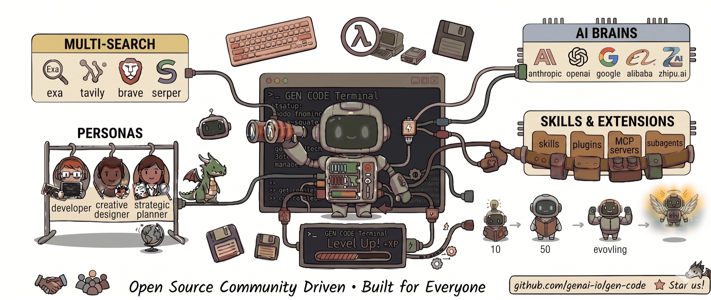

<div align="center">
  <h1>&lt; GEN ✦ /&gt;</h1>
  <p><strong>面向终端的开源「专用 Agent 统一运行时」</strong></p>
  <p>
    <a href="https://github.com/genai-io/gen-code/releases"></a>
    <a href="https://genai-io.github.io/gen-code/"></a>
    <a href="https://genai-io.github.io/gen-code/getting-started.html"></a>
    <a href="docs/index.md"></a>
    <a href="LICENSE"></a>
  </p>
  <p>
    <a href="README.md">English</a> · <strong>简体中文</strong>
  </p>
  <p>
    
  </p>
  <p>
    <a href="https://genai-io.github.io/gen-code/intro.html"><b>▶ 观看动态简介</b></a>
  </p>
</div>

Gen Code 是面向终端的**专用 Agent 统一运行时**（Unified Specialized Agent Runtime）—— 不止于编程 —— 构建在五大可插拔能力之上：**模型（LLM）**、**搜索引擎**、**人设（Personas）**、**技能与扩展**（skills、plugins、MCP servers、subagents），以及**随使用不断自我进化、逐级升级**的 Agent。使用 Go 实现。

## 特性

### 开放架构

- **模型提供商** —— Anthropic、OpenAI、Google、DeepSeek、Moonshot、Alibaba、MiniMax、Z.ai（GLM）；通过 `/model` 切换。
- **搜索后端** —— Exa、Tavily、Brave、Serper；通过 `/search` 切换。
- **Persona 人设** —— 以 Markdown 定义身份，可在用户或项目作用域生效；通过 `/identity` 切换（[详情](docs/concepts/harness-channels.md#identity-custom-personas)）。
- **技能与扩展** —— Claude Code 的 skills、plugins、MCP servers 无需改动即可运行；沙箱化 subagent；生命周期 hooks（shell、LLM、agent、HTTP）；项目记忆自动加载。
- **自我进化** —— 每隔几轮对话，后台 reviewer 会把近期的工作提炼为持久记忆与可复用技能，让 Agent 随使用逐级升级。*（Level 1 已可用，更高等级仍在推进。）*

### 工程实现

- **随处运行** —— 单一约 12 MB 二进制，零运行时依赖（无需 Node.js、Python）。原生 Go：冷启动约 0.01s、基线内存约 32 MB，同一文件可在笔记本、边缘设备或 `scratch` 容器中直接运行（[体积](docs/operations/footprint.md) · [基准测试](#基准测试gen-code-vs-claude-code)）。
- **事件驱动协同** —— 基于 pub/sub hub 的并行 subagent 执行（[架构说明](docs/packages/subagent.md)）。
- **会话持久化** —— 自动保存、恢复、Fork 以及自动上下文压缩。
- **Prompt 预测** —— 推测式地预生成可能的下一个 prompt 以降低延迟。
- **会话检查器** —— 本地 Web UI，用于转录回放、系统 prompt 取证以及活跃会话的实时追踪（`gen inspector`）。


## 安装

```bash
curl -fsSL https://raw.githubusercontent.com/genai-io/gen-code/main/install.sh | bash
```

升级直接重新执行同样的命令。卸载：

```bash
curl -fsSL https://raw.githubusercontent.com/genai-io/gen-code/main/install.sh | bash -s uninstall
```

<details>
<summary><b>其他安装方式</b></summary>

**通过 Go Install**

```bash
go install github.com/genai-io/gen-code/cmd/gen@latest
```

**从源码构建**

```bash
git clone https://github.com/genai-io/gen-code.git
cd gen-code
go build -o gen ./cmd/gen
mkdir -p ~/.local/bin && mv gen ~/.local/bin/
```

</details>

## 使用

```bash
gen                            # 交互模式
gen "解释这个函数"             # 一次性运行
cat main.go | gen "review"     # 管道输入
gen --continue                 # 恢复最近的会话
gen --resume                   # 选择历史会话恢复
gen inspector                  # 打开会话转录查看器
```

| 操作 | 命令 / 快捷键 |
|---|---|
| 选择 / 切换模型 | `/model` —— 保存到 `~/.gen/providers.json` |
| 切换 thinking 级别 | `Ctrl+T` 或 `/think`（可选级别因提供商而异） |
| 所有 slash 命令 | `/help`（`/identity`、`/search`、`/skills`、`/agents`、`/mcp`、`/compact` 等） |
| 切换权限模式 | `Shift+Tab`（询问 · 自动接受 · 计划） |
| 展开工具 · 取消 · 退出 | `Ctrl+O` · `Ctrl+C` · `Ctrl+D` |

API Key：设置对应的环境变量（见下方凭据表）或在首次启动时按提示粘贴。完整入门：[`docs/guides/getting-started.md`](docs/guides/getting-started.md)。

### 配置文件

配置位于 `~/.gen/`（用户级）与 `<项目>/.gen/`（项目级，覆盖用户级）。项目根目录下的 `GEN.md` 或 `CLAUDE.md` 会被自动加载到系统 prompt。

<details>
<summary><b>凭据</b></summary>

| 服务 | 环境变量 |
|:--------|:---------|
| **Anthropic** (Claude) | `ANTHROPIC_API_KEY` 或 [Vertex AI](https://cloud.google.com/vertex-ai/generative-ai/docs/partner-models/claude) |
| **OpenAI** (GPT, o 系列, Codex) | `OPENAI_API_KEY` |
| **Google** (Gemini) | `GOOGLE_API_KEY` |
| **Moonshot** (Kimi) | `MOONSHOT_API_KEY` |
| **DeepSeek** (DeepSeek V4) | `DEEPSEEK_API_KEY` |
| **Alibaba** (Qwen) | `DASHSCOPE_API_KEY` |
| **MiniMax** | `MINIMAX_API_KEY` |
| **Z.ai** (GLM) | `BIGMODEL_API_KEY` |
| **Ollama** (本地) | `OLLAMA_BASE_URL`（默认 `http://localhost:11434/v1`） |
| **Exa** 搜索 | _无需_（默认） |
| **Tavily** 搜索 | `TAVILY_API_KEY` |
| **Brave** 搜索 | `BRAVE_API_KEY` |
| **Serper** 搜索 | `SERPER_API_KEY` |

</details>

<details>
<summary><b>目录结构</b></summary>

用户级（`~/.gen/`）：

```
providers.json    # 提供商连接信息与当前模型
settings.json     # 权限、hooks、env、identity
skills.json       # 技能状态
identities/       # 自定义人设（参见 /identity）
skills/           # 自定义技能定义
agents/           # 自定义 agent 定义
commands/         # 自定义 slash 命令
plugins/          # 已安装插件
projects/         # 会话记录与索引
```

项目级（`.gen/`）：

```
settings.json      # 权限、hooks、禁用工具
mcp.json           # MCP server 定义
identities/*.md    # 项目级 persona（覆盖用户级）
agents/*.md        # Subagent 定义
skills/*/SKILL.md  # 技能
commands/*.md      # Slash 命令
```

</details>

## 基准测试：Gen Code vs Claude Code

在 Apple Silicon 上对比 [Claude Code](https://claude.ai/code) v2.1.112，使用相同模型（`claude-sonnet-4-6`）：

| 指标 | Gen Code | Claude Code | 优势 |
|--------|---------|-------------|-----------|
| 下载大小 | 12 MB | 63 MB（+ Node.js 112 MB） | **小 5 倍** |
| 磁盘占用 | 38 MB | 175 MB | **小 4.6 倍** |
| 启动耗时 | ~0.01s | ~0.20s | **快 20 倍** |
| 启动内存 | ~32 MB | ~189 MB | **省 5.8 倍** |
| 简单任务 | ~2.4s / 39 MB | ~10.4s / 286 MB | **快 4.3 倍、省内存 7.3 倍** |
| 工具调用任务 | ~3.3s / 39 MB | ~26.0s / 285 MB | **快 7.9 倍、省内存 7.2 倍** |

两者特性大体可比（hooks、skills、plugins、session、MCP 等）。性能差距来自 Go 的原生编译、精简的架构设计和克制的 prompt 工程 —— 对比 Node.js 的 V8/JIT/GC 运行时开销。

完整数据见：[docs/operations/benchmark.md](docs/operations/benchmark.md)

## 文档

- [文档索引](docs/index.md) —— 架构、特性、运维、参考资料的入口
- [架构](docs/architecture.md) —— 架构入口与阅读顺序
- [包结构图](docs/reference/package-map.md) —— 包归属与依赖边界
- [系统 Prompt](docs/concepts/harness-channels.md) —— Slot 模型、identity、技能/agent 注入
- [Subagents](docs/packages/subagent.md) · [Skills](docs/packages/skill.md) · [Plugins](docs/packages/plugin.md) · [MCP](docs/packages/mcp.md)
- [Hooks](docs/packages/hook.md) · [Permissions](docs/concepts/permission-model.md) · [Tasks](docs/packages/task.md)
- [Inspector](docs/inspector.md) —— 本地 Web UI，用于转录回放与调试
- 每个包的设计文档见 [`docs/packages/`](docs/packages/)，从[包索引](docs/packages/index.md)开始

## 相关项目

- [Claude Code](https://claude.ai/code) —— Anthropic 的 AI 编程助手
- [Aider](https://github.com/paul-gauthier/aider) —— 终端中的 AI 结对编程
- [Continue](https://github.com/continuedev/continue) —— 开源 AI 编程助手

## 贡献

欢迎贡献！请阅读 [CONTRIBUTING.md](CONTRIBUTING.md) 中的指南。

## 许可证

Apache License 2.0 —— 详见 [LICENSE](LICENSE)。
