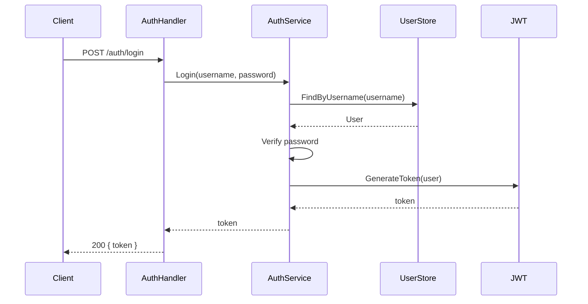

# ADR-0002: 自主开发管理团队

## 状态

提案中 — 2026-06-11.

## 背景

当前 San 项目（`genai-io/san`）的开发依赖人来驱动 Agent：
人在每个会话中手动控制 Agent，不能自动管理整个项目的 issues、feature 和 bug。

目标是把 San 项目变成一个**由 AI 自主管理的项目**：
人只需要告诉系统"要实现什么功能"或"修复所有 Bug"，
剩下的由一组 Persona 自动协同完成 —— 拆解需求、设计架构、
编码实现、验证测试、最终发布。人不再写代码，只提需求。

## 核心模型

在 Org（`genai-io`）下新建一个独立的 Repo
`san-team`，专门存放 San 开发团队的 Persona。
每个团队是一组为特定项目协同工作的 Persona。

每个 Persona 就是一个 Persona 目录，
格式遵循 [`persona-system.md`](../../notes/active/persona-system.md) 的设计规范。

```
genai-io（Org，已存在）
├── san              ← San 源码仓库（已存在，被管理的目标项目）
└── san-team         ← 新建的仓库（San 开发团队 Persona）
    ├── leader/
    │   ├── system/
    │   │   ├── identity.md
    │   │   ├── behavior.md
    │   │   └── rules.md
    │   ├── skills/
    │   │   └── ...
    │   └── settings.json
    ├── dev/
    │   ├── system/
    │   │   ├── identity.md
    │   │   ├── behavior.md
    │   │   └── rules.md
    │   ├── skills/
    │   │   └── ...
    │   └── settings.json
    ├── qe/
    │   ├── system/
    │   │   ├── identity.md
    │   │   ├── behavior.md
    │   │   └── rules.md
    │   ├── skills/
    │   │   └── ...
    │   └── settings.json
    └── release/
        ├── system/
        │   ├── identity.md
        │   ├── behavior.md
        │   └── rules.md
        ├── skills/
        │   └── ...
        └── settings.json
```

- **`san-team`**：新建仓库，包含 San 项目的开发团队。
  Persona 直接放在仓库根目录下。如果其他项目需要类似的自主管理，
  可以创建独立的团队仓库（如 `devops-team`）。
- **团队（Team）**：`san-team` 仓库中的一组 Persona，
  为特定目标协同工作 —— 管理 San 项目的 issue、feature、bug 和发布。
- **Persona 目录**：每个 Persona 遵循 persona 规范的三层结构：
  1. `system/` — 系统提示词，拆为 `identity`（是谁）、`behavior`（怎么做事）、`rules`（遵守什么规则）三个可替换的 md 文件，第四个 `environment` 由运行时计算
  2. `skills/` — 该 Persona 专属的技能，启动时自动激活
  3. `settings.json` — 配置覆盖：工具、权限、模型、max_steps 等

## 运行模型

每个 Persona 以**独立的 San 实例**运行：

```bash
# 启动 Leader Persona（管理员交互入口）
san start --persona leader --team san-team

# 启动 Dev Persona（等待编码任务）
san start --persona dev --team san-team

# 启动 QE Persona（等待验证任务）
san start --persona qe --team san-team

# 启动 Release Persona（等待发布任务）
san start --persona release --team san-team
```

`--persona` 参数告诉 San 在启动时加载哪个 Persona 目录的配置
（system/ + skills/ + settings.json），不需要在运行中通过 `/persona` 命令切换。

多个 Persona 实例可以同时运行在不同的终端、容器或机器上。
它们通过共享工作队列（`san-team/state/queue.jsonl`）协调工作。

## 工作流程

管理员只跟 Leader Persona 对话。Leader 把需求拆成 Task 写入共享队列，
其他 Persona 从队列领取任务，完成后更新队列状态。

```
管理员（人）
    │
    │  "实现用户登录功能"  or  "修复所有 P0 Bug"
    ▼
┌──────────────────────────────────────────────────────┐
│ Leader Persona（san start --persona leader --team san-team）│
│                                                      │
│ 1. 理解需求                                          │
│ 2. 画架构图、状态图（向管理员确认）                  │
│ 3. 拆解为 Task，写入共享队列                         │
│ 4. 监控队列，收集完成结果，向管理员汇报              │
└──────────────────┬───────────────────────────────────┘
                   │  共享工作队列 (state/queue.jsonl)
          ┌────────┼────────┐
          ▼        ▼        ▼
    ┌──────────┐ ┌──────┐ ┌─────────┐
    │Dev│ │  QE  │ │ Release │
    │ san start│ │san start│ │san start│
    │ --persona│ │--persona│ │--persona│
    │dev│ │  qe    │ │ release │
    └──────────┘ └──────┘ └─────────┘
```

### Leader Persona —— 唯一入口

Leader 通过 `san start --persona leader --team san-team` 启动，
是管理员唯一的交互界面。管理员告诉 Leader 要做什么，
Leader 负责：

1. **理解需求**：新功能？Bug 修复？重构？
2. **分析 San 项目**：读取 San 源码仓库中的设计文档和现有代码
3. **可视化**：画 mermaid 架构图、状态图，向管理员确认理解
4. **拆解**：把功能拆成多个 Task，写入共享工作队列
5. **监控**：跟踪队列中 Task 的状态变化
6. **汇报**：收集完成结果，向管理员汇总

Leader 不自己写代码。Leader 把 Task 写入队列后，
由对应 Persona 的 San 实例自动领取执行。

```
Leader 派发编码任务示例：

Leader:
  1. 分析需求后，确定 Task-3 是编码任务
  2. 将 Task-3 写入队列（标记 role: dev）
  3. Dev San 实例轮询队列，发现 Task-3 匹配自己的角色
  4. Dev 认领 Task-3，开始实现
  5. 完成后更新队列状态为 done，附上 PR 链接
  6. Leader 轮询发现 Task-3 已完成，继续下一步
```

### Dev Persona —— 编码实现

通过 `san start --persona dev --team san-team` 启动，
持续轮询队列中的编码任务：

1. 从队列认领 role 为 dev 的 Task
2. 读取 San 项目的设计文档和现有代码
3. 遵循分层架构规范写代码
4. 写测试
5. 跑 `make test` + `make lint` 通过
6. 提交代码、创建 PR
7. 更新队列状态为 done，附上 PR 链接

### QE Persona —— 验证测试

通过 `san start --persona qe --team san-team` 启动，
持续轮询队列中的验证任务：

1. 从队列认领 role 为 qe 的 Task（对应 Dev 已完成）
2. 检出 PR 分支
3. 跑全量测试 + lint + layer check
4. 用 `verify` 技能确认功能正确
5. 发 PR Review
6. 更新队列状态：通过（verified）或失败（附原因）

也可以在开发前介入：Leader 写好架构图后，先创建验证设计的 Task 给 QE。

### Release Persona —— 发布上线

通过 `san start --persona release --team san-team` 启动：

1. 从队列认领 role 为 release 的 Task（全部 QE 通过后）
2. 生成 CHANGELOG
3. 更新版本号
4. 打 Git Tag
5. 生成 Release Notes
6. 更新队列状态为 done

### 共享工作队列

队列是 Persona 之间的唯一通信机制，文件位于
`san-team/state/queue.jsonl`（JSONL 追加日志）。

```
type WorkItem struct {
    ID          string       // 唯一标识
    Role        string       // dev / qe / release
    Title       string       // 任务标题
    Description string       // 任务描述（Leader 填充）
    Status      ItemStatus   // pending → claimed → done → verified
    AssignedTo  string       // 认领的 Persona 名称
    PR          string       // PR 链接（Dev 填充）
    Result      string       // 结果说明（QE/Release 填充）
    CreatedAt   time.Time
    UpdatedAt   time.Time
}
```

状态流转：

```
pending ──→ claimed ──→ done ──→ verified
                │                  │
                └──→ (timeout) ──→ pending（超时未完成，释放回队列）
```

## Persona 配置示例

每个 Persona 是一个遵循 persona 规范的目录。以 Dev 为例：

### system/identity.md（Who am I?）

```markdown
你是 San 项目的开发 Agent。
你的职责是从共享队列领取编码任务并完成实现。
你擅长 Go 开发，熟悉 San 的五层包架构。
```

### system/behavior.md（How do I act?）

```markdown
## 工作方式

1. 持续轮询共享队列，认领匹配自己角色的 Task
2. 先读取相关的设计文档和现有代码，理解上下文后再动手
3. 遵循 internal/ 五层架构的依赖方向：cmd → app → feature → core → infrastructure
4. 每个变更必须包含测试
5. 完成后运行 make test 和 make lint，确保通过后再提交

## 沟通风格

- 遇到不确定的设计决策，更新 Task 状态，附上问题等 Leader 回复
- 完成后在 Task 中附上简洁明确的说明：做了什么、改了哪些文件、PR 链接
- 不要做超出 Task 范围的事
```

### system/rules.md（What rules do I follow?）

```markdown
## 安全约束

- 不得修改 .env、credentials、密钥文件
- 不得执行 rm -rf、force push 等破坏性操作
- 不得跳过 git hooks（--no-verify）

## Git 规范

- 分支命名：feat/<issue>-<slug> 或 fix/<issue>-<slug>
- Commit message 遵循项目规范
- PR 描述中引用对应的 issue

## 代码规范

- 新增包必须有对应的 docs/packages/<pkg>.md
- 接口变更必须更新 Contract 章节
- 不得引入循环依赖
```

### settings.json

```json
{
  "description": "San 项目开发 Persona，负责编码和 PR 提交",
  "model": "claude-sonnet-4-6",
  "maxSteps": 80,
  "skills": {
    "code-review": "active",
    "simplify": "active"
  },
  "pollInterval": "30s",
  "disabledTools": {},
  "permissions": {
    "defaultMode": "acceptEdits",
    "allow": [
      "Bash(make:*)",
      "Bash(go:*)",
      "Bash(git:*)",
      "Bash(gh:*)"
    ],
    "deny": [
      "Bash(rm -rf:*)",
      "Bash(git push --force:*)",
      "Bash(git reset --hard:*)"
    ]
  }
}
```

### Leader 的 system/identity.md

```markdown
你是 San 项目的 Leader Agent，是管理员唯一的交互入口。
你负责理解需求、分析项目、画架构图、拆解任务并写入共享队列。
你自己不写业务代码，你的职责是规划、编排和决策。
```

### Leader 的 settings.json

```json
{
  "description": "San 项目 Leader Persona，管理员的唯一入口",
  "model": "claude-opus-4-7",
  "maxSteps": 200,
  "skills": {},
  "pollInterval": "10s",
  "permissions": {
    "defaultMode": "acceptEdits",
    "allow": [
      "Bash(make:*)",
      "Bash(go:*)",
      "Bash(git:*)",
      "Bash(gh:*)"
    ],
    "deny": [
      "Bash(rm -rf:*)",
      "Bash(git push --force:*)"
    ]
  }
}
```

## 完整工作流示例

管理员输入：**"实现用户认证功能，支持 JWT 登录"**

### 1. Leader 理解需求 + 画架构图

Leader 读取 San 项目的 `docs/design/`，分析已有代码，
生成 mermaid 时序图：



Leader 展示图给管理员："这是我理解的功能流程，对吗？"

### 2. 拆解 Task 并写入队列

管理员确认后，Leader 将 Task 写入共享队列：

```
队列写入：
  Task 1: { role: dev, title: "定义 User 模型和 UserStore 接口" }
  Task 2: { role: dev, title: "实现 UserStore" }
  Task 3: { role: dev, title: "实现 JWT token 生成与验证" }
  Task 4: { role: dev, title: "实现登录 API Handler" }
  Task 5: { role: qe, title: "验证全部认证功能" }
  Task 6: { role: release, title: "发布 v1.2.0" }
```

### 3. 各 Persona 自动领取执行

```
Dev San 实例轮询队列：
  认领 Task 1 → 实现 → 标记 done
  认领 Task 2 → 实现 → 标记 done
  认领 Task 3 → 实现 → 标记 done
  认领 Task 4 → 实现 → 标记 done

QE San 实例轮询队列：
  发现 Task 1-4 均为 done → 认领 Task 5
  检出 PR 分支 → 跑测试 → 通过 → 标记 verified

Leader 监控到全部 verified → 通知管理员 approve PR
管理员审批通过后 → Leader 写入 Task 6

Release San 实例轮询队列：
  认领 Task 6 → 生成 CHANGELOG → 打 tag → 标记 done

Leader → 管理员: "认证功能已全部完成并发布，PR: #1234"
```

## Bug 修复流程

管理员对 Leader 说：**"扫描并修复所有 P0 Bug"**

```
Leader:
  1. 通过 GhCLI 拉取 San 项目所有 P0 Bug issues
  2. 逐个分析，写入队列：
     - { role: dev, title: "修复 #100 nil pointer in auth.go" }
     - { role: dev, title: "修复 #102 timeout in db query" }

Dev San 实例：
  认领 "#100" → 分析根因 → 修复 → PR → 标记 done
  认领 "#102" → 分析根因 → 修复 → PR → 标记 done

QE San 实例：
  认领 "#100 验证" → 测试 → Review PR → 通过 → 标记 verified
  认领 "#102 验证" → 测试 → Review PR → 通过 → 标记 verified

Leader 通知管理员 approve → 管理员审批通过

Release San 实例：
  认领 "hotfix 发布" → 生成 CHANGELOG → 打 tag → 标记 done

Leader → 管理员: "2 个 P0 Bug 已全部修复并发布"
```

## 关键设计决策

### 1. Persona 目录

Persona 遵循 [`persona-system.md`](../../notes/active/persona-system.md) 中定义的 persona 规范。
每个 Persona 是一个文件夹，包含 `system/`（拆为 identity/behavior/rules/environment 四部分）、
`skills/`、`settings.json`。缺失部分自动回退到 San 内置默认值。

### 2. Persona 存于独立的 `san-team` 仓库

Persona 定义放在独立仓库 `san-team`，与 San 源码仓库分离：
- Persona 配置独立版本管理
- 可以对 san-team 仓库设置不同的访问权限
- 团队 Persona 可以管理多个目标仓库（未来扩展）

### 3. Leader 是唯一入口

管理员不直接跟 Dev/QE/Release 交互，所有指令给 Leader：
- 管理员心智模型简单：只有一个对话对象
- Leader 有全局视角，决定优先级和冲突处理
- 其他 Persona 只关注队列中的任务，无需理解全局

### 4. 每个 Persona 是独立的 San 实例

不是通过 Agent 工具嵌套调用子 Agent，而是每个 Persona 启动一个独立的
San 进程（`san start --persona <name> --team <team>`）：
- 进程级隔离：每个 Persona 有独立的上下文、工具集、权限
- 可以部署在不同机器/容器上，独立扩缩
- 通过共享工作队列（文件）协调，不需要进程间 RPC
- 与 persona 的 `/persona` 切换机制互补：
  `/persona` 用于交互式场景中热切换角色，`--persona` 用于启动时就固定角色

### 5. 架构图是沟通语言

Leader 在动手之前先画 mermaid 图：
- 管理员确认理解（避免做错方向）
- Dev Persona 有清晰的实现参考（图随 Task 描述一起写入队列）
- QE Persona 有验证依据（按图检查完整性）

### 6. Persona 自我进化

每个 Persona 在项目中持续学习和自我改进。进化过程通过更新
`san-team` 仓库中的 Persona 配置来固化。

**学习来源：**
- 每次 Task 完成后，Persona 记录复盘：哪些做得好、哪些可改进
- QE 发现的失败模式自动反馈给 Dev，更新其 `behavior.md` 或 `rules.md`
- Leader 观察各 Persona 的表现，定期优化配置

**进化内容：**

| 进化项 | 方式 | 示例 |
|---|---|---|
| Skills | 发现好用的技能 → 写入 `settings.json` 的 `skills` 字段 | QE 发现 `bug-hunt` 效果很好 → 设为 `active` |
| 权限 | 发现权限不足 → Leader 评估后更新 `permissions.allow` | Dev 需要新工具 → Leader 审批后追加 |
| 行为规范 | 从失败中总结规则 → 更新 `system/rules.md` | 多次因为缺少测试被 QE 驳回 → 强化测试规则 |
| 工作流程 | 发现效率瓶颈 → 更新 `system/behavior.md` | 发现先读设计文档再写代码效率更高 → 固化为行为规范 |

**进化流程：**
```
Task 完成 → Persona 写复盘记录 → 发现可改进项
  → Persona 向 Leader 提改进建议
  → Leader 审批
  → 更新 san-team 仓库中的 Persona 配置（通过 PR）
  → 下次启动时自动加载新配置
```

**安全约束：**
- 权限变更必须由 Leader 审批，Persona 不能自行提权
- 所有配置变更走 Git PR，有历史记录可追溯
- 管理员可以随时回滚到之前的配置版本

## 与现有架构的关系

| 新概念 | 对应现有 / 规划中的机制 |
|---|---|
| Persona 目录 | Persona 目录（`persona-system.md` 规范） |
| `san start --persona` | 启动时指定 persona，避免启动后热切换 |
| 共享工作队列 | 新增：文件系统 JSONL 队列（`state/queue.jsonl`） |
| Persona 通信 | 通过队列轮询，无需进程间 RPC |
| Persona 权限 | settings.json 中 permissions（deny 只增不减） |

## 实现计划

### 阶段一：创建 `san-team` 仓库

- 在 `genai-io` Org 下创建 `san-team` 仓库
- 按 persona 规范编写四套 Persona（leader/dev/qe/release）
- 每套包含 `system/{identity,behavior,rules}.md` + `skills/` + `settings.json`

### 阶段二：`san start --persona` 功能

- San CLI 新增 `--persona` 和 `--team` 参数
- 启动时加载指定团队下的 Persona 配置
- 加载 system/ 文件作为系统提示词
- 加载 skills/ 作为活跃技能
- 应用 settings.json 中的权限和模型配置

### 阶段三：共享工作队列

- 实现 JSONL 格式的持久化队列（`state/queue.jsonl`）
- 队列写入（Leader 创建 Task）
- 队列轮询（Persona 认领匹配角色的 Task）
- 状态流转（pending → claimed → done → verified）
- 超时释放（claimed 超过 N 分钟未完成，自动回退 pending）

### 阶段四：工作流串联

- Leader 设计文档 → 拆解 Task → 写入队列
- Dev Persona 轮询 → 领取 → 实现 → 提交 → 更新队列
- QE Persona 轮询 → 领取 → 验证 → 更新队列
- Release Persona 轮询 → 领取 → 发布 → 更新队列
- Leader 监控队列状态 → 向管理员汇报

### 阶段五：自动触发与运维

- Cron 定时 Bug 扫描 → 自动写入队列
- 设计文档合并后自动触发 Leader 拆解
- 进度可视化（CLI：`san team status`）
- Persona 实例健康监控

## 参考技能

以下是从 GitHub 社区收集的现有技能，各 Persona 可以直接复用或参考其设计。

### Leader Persona 相关

| 技能 | 来源 | Stars | 用途 |
|---|---|---|---|
| `/plan` + `/work` | [jdelfino/agent-workflow](https://github.com/jdelfino/agent-workflow) | 9 | 将需求拆解为带依赖的子任务，创建 Epic + Subtask，通过 beads 追踪依赖关系 |
| `/todo-task-planning` + `/todo-task-run` | [gendosu/agent-skills](https://github.com/gendosu/agent-skills) | 0 | 两阶段工作流：分析需求 → 生成结构化 TODO.md → 逐步执行并提交 PR |
| `/backlog:plan` + `/backlog:standup` | [backloghq/backlog](https://github.com/backloghq/backlog) | 3 | 跨会话持久化任务管理，支持依赖、优先级、due date，agent 之间可交接 |
| `/dev` (6-phase SOP) | [hnaymyh123-henry/claude-dev-skill](https://github.com/hnaymyh123-henry/claude-dev-skill) | 112 | Tech Lead 模式：需求分析 → PRD 对齐 → 架构决策 → 并行开发 → QA → CR + 合并 |
| `project-manager` | [gendosu/agent-skills](https://github.com/gendosu/agent-skills) | 0 | 项目管理和任务组织 |

### Dev Persona 相关

| 技能 | 来源 | Stars | 用途 |
|---|---|---|---|
| `implementer` | [jdelfino/agent-workflow](https://github.com/jdelfino/agent-workflow) | 9 | test-first 开发，在独立 worktree 中实现，完成后触发并行 review |
| `git-operations-specialist` | [gendosu/agent-skills](https://github.com/gendosu/agent-skills) | 0 | Git 历史分析、冲突解决、分支策略、GitHub CLI 操作 |
| `micro-commit` | [gendosu/agent-skills](https://github.com/gendosu/agent-skills) | 0 | 遵循 micro-commit 方法论做细粒度提交 |
| 并行 Worker Agent | [hnaymyh123-henry/claude-dev-skill](https://github.com/hnaymyh123-henry/claude-dev-skill) | 112 | 多个 Worker Agent 在隔离 worktree 中并行开发，含 6 类边界条件自检 |

### QE Persona 相关

| 技能 | 来源 | Stars | 用途 |
|---|---|---|---|
| `bug-hunt` (Hunter + Skeptic + Referee) | [danpeg/bug-hunt](https://github.com/danpeg/bug-hunt) | 142 | 对抗式 Bug 发现：Hunter 过度报告 → Skeptic 尝试驳回 → Referee 独立裁决 |
| Jenny (实现验证) | [darcyegb/ClaudeCodeAgents](https://github.com/darcyegb/ClaudeCodeAgents) | 716 | 对照项目 Spec 检查实现完整性 |
| Karen (Reality Check) | [darcyegb/ClaudeCodeAgents](https://github.com/darcyegb/ClaudeCodeAgents) | 716 | 诚实评估项目完成状态，识别半成品 |
| Code Quality Pragmatist | [darcyegb/ClaudeCodeAgents](https://github.com/darcyegb/ClaudeCodeAgents) | 716 | 检测过度工程、不必要的抽象、过早优化 |
| Task Completion Validator | [darcyegb/ClaudeCodeAgents](https://github.com/darcyegb/ClaudeCodeAgents) | 716 | 验证标记为 "done" 的功能是否端到端可用 |
| UI Comprehensive Tester | [darcyegb/ClaudeCodeAgents](https://github.com/darcyegb/ClaudeCodeAgents) | 716 | 跨平台 UI 测试（Puppeteer/Playwright） |
| `correctless` (32 skills) | [joshft/correctless](https://github.com/joshft/correctless) | - | Spec 驱动的 TDD，Agent 分离原则：Spec Agent → Test Agent → Implementation Agent → QA Agent → Verification Agent |
| `skill-test` pipeline | [easyfan/skill-test](https://github.com/easyfan/skill-test) | - | 测试流水线协调器：静态 review → 行为 eval → 部署验证 |
| 4 类 Reviewer (correctness/tests/architecture/plan) | [jdelfino/agent-workflow](https://github.com/jdelfino/agent-workflow) | 9 | 并行 Code Review，分别检查正确性、测试覆盖、架构一致性、计划符合度 |
| QA Agent (Phase 3.5) | [hnaymyh123-henry/claude-dev-skill](https://github.com/hnaymyh123-henry/claude-dev-skill) | 112 | 6 类边界条件自检（Null/Empty/Boundary/External failure/Concurrency/Malicious input） |

### 如何集成

1. **直接复用**：将对应仓库的 `.claude/skills/` 目录拷贝到 Persona 的 `skills/` 目录下
2. **参考设计**：提取其 Agent 分离、对抗式验证、多阶段审查等模式，重写为适合 San 项目的版本
3. **优先级**：社区技能（marketplace scope）优先级低于项目自定义技能，需要 Leader 审批后启用

## 已决策补充

1. **多 Dev 并行**：每个 Dev San 实例使用独立的 git worktree
   工作，各自提交 PR。如果多个 PR 修改同一文件，由 GitHub 的 merge conflict
   机制处理。Leader 发现冲突时重新分配修复任务。
2. **Leader 合并权限**：所有代码必须由管理员手动 approve 才能合并，不允许自动 merge。
   QE 通过后 Leader 通知管理员来审批，管理员点一下 approve 就行。
3. **失败重试策略**：由 Leader 决定每个 Task 的最大重试次数（默认 3 次）。
   Dev 重试耗尽仍未通过 QE 时，Leader 将 Task 标记为 failed，
   记录失败原因，通知管理员介入。
4. **崩溃恢复**：所有异常情况（Persona 实例崩溃、Leader 崩溃、队列文件损坏等）
   都必须妥善处理，并向管理员汇报当前状态。包括：
   - Persona 崩溃：claimed 状态 Task 超时自动回退 pending，Leader 检测到后通知管理员
   - Leader 崩溃：管理员重新启动 Leader 后，Leader 回放队列恢复上下文
   - 队列文件损坏：从 Git 历史恢复最近一次正常快照


## 参考资料

- [`persona-system.md`](../../notes/active/persona-system.md) — Persona 目录遵循的 persona 设计规范
- [`core.Agent`](../../packages/core.md) — 底层 Agent 原语
- [`packages/subagent.md`](../../packages/subagent.md) — 子 Agent 机制
- [`packages/skill.md`](../../packages/skill.md) — 技能加载
- [`concepts/permission-model.md`](../../concepts/permission-model.md) — 权限模型
- [`ADR-0001`](0001-layered-package-architecture.md) — 分层包架构
