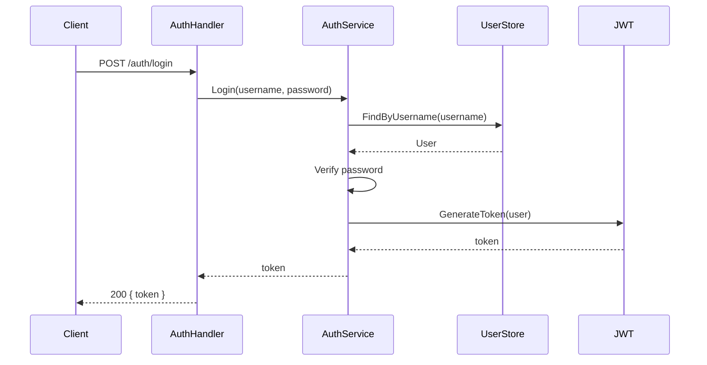

# ADR-0002: Autonomous Development Management Team

## Status

Proposed — 2026-06-11.

## Context

Development of the San project (`genai-io/san`) currently relies on a
human to drive the agent in every session. Issues, features, and bugs
are not managed autonomously.

The goal is to make San a **fully AI-managed project**: humans only
express intent ("build feature X", "fix all P0 bugs"), and a team of
Personas handles everything — breaking down requirements, designing
architecture, writing code, running tests, and shipping releases.
Humans stop writing code and only state what they want.

## Core Model

Under the existing Org (`genai-io`), create a **new, separate Repo**
`san-team` for storing the San development team's Personas.
Each team is a collection of Personas that collaborate on a specific project.

Each Persona follows the
[`persona-system.md`](../../notes/active/persona-system.md) design spec.

```
genai-io（Org, existing）
├── san              ← San source repo (existing, the managed project)
└── san-team         ← New repo (San development team Personas)
    ├── leader/
    │   ├── system/
    │   │   ├── identity.md
    │   │   ├── behavior.md
    │   │   └── rules.md
    │   ├── skills/
    │   │   └── ...
    │   └── settings.json
    ├── dev/
    │   ├── system/
    │   │   ├── identity.md
    │   │   ├── behavior.md
    │   │   └── rules.md
    │   ├── skills/
    │   │   └── ...
    │   └── settings.json
    ├── qe/
    │   ├── system/
    │   │   ├── identity.md
    │   │   ├── behavior.md
    │   │   └── rules.md
    │   ├── skills/
    │   │   └── ...
    │   └── settings.json
    └── release/
        ├── system/
        │   ├── identity.md
        │   ├── behavior.md
        │   └── rules.md
        ├── skills/
        │   └── ...
        └── settings.json
```

- **`san-team`**: New repo containing the San project's development team.
  Personas live directly under the repo root. If other projects need
  similar autonomous management, they can create their own team repos
  (e.g., `devops-team`).
- **Team**: A collection of Personas in the `san-team` repo that
  collaborate toward a specific goal — managing the San project's issues,
  features, bugs, and releases.
- **Persona directory**: Each Persona follows the persona spec's three-layer
  structure:
  1. `system/` — system prompt split into `identity` (who), `behavior` (how),
     `rules` (constraints). The fourth part `environment` is computed at runtime.
  2. `skills/` — Persona-scoped skills, activated at startup.
  3. `settings.json` — config overlay: tools, permissions, model, max_steps, etc.

## Runtime Model

Each Persona runs as an **independent San instance**:

```bash
# Start Leader Persona (admin interaction entry point)
san start --persona leader --team san-team

# Start Dev Persona (waits for coding tasks)
san start --persona dev --team san-team

# Start QE Persona (waits for verification tasks)
san start --persona qe --team san-team

# Start Release Persona (waits for release tasks)
san start --persona release --team san-team
```

The `--persona` flag tells San to load a specific Persona directory's
config (system/ + skills/ + settings.json) at startup, avoiding the
need for mid-session `/persona` switching.

Multiple Persona instances can run simultaneously in different
terminals, containers, or machines. They coordinate through a shared
work queue (`san-team/state/queue.jsonl`).

## Workflow

The admin talks only to the Leader Persona. Leader breaks requirements
into Tasks and writes them to the shared queue. Other Personas poll the
queue, claim matching tasks, complete them, and update the queue status.

```
Admin (human)
    │
    │  "Build user authentication"  or  "Fix all P0 bugs"
    ▼
┌──────────────────────────────────────────────────────┐
│ Leader Persona (san start --persona leader --team san-team)│
│                                                      │
│ 1. Understand intent                                │
│ 2. Draw architecture & state diagrams               │
│ 3. Break down into Tasks, write to shared queue     │
│ 4. Monitor queue, collect results, report to admin  │
└──────────────────┬───────────────────────────────────┘
                   │  Shared work queue (state/queue.jsonl)
          ┌────────┼────────┐
          ▼        ▼        ▼
    ┌──────────┐ ┌──────┐ ┌─────────┐
    │Dev│ │  QE  │ │ Release │
    │ san start│ │san start│ │san start│
    │ --persona│ │--persona│ │--persona│
    │dev│ │  qe    │ │ release │
    └──────────┘ └──────┘ └─────────┘
```

### Leader Persona — Single Entry Point

Started via `san start --persona leader --team san-team`.
The admin's only interface. Leader handles:

1. **Understand intent**: new feature? bug fix? refactor?
2. **Analyze San**: read design docs and existing code in the San repo
3. **Visualize**: draw mermaid architecture/state diagrams, confirm with admin
4. **Break down**: decompose into Tasks, write to shared work queue
5. **Monitor**: track Task status changes in the queue
6. **Report**: collect results, summarize for the admin

Leader does not write code. It writes Tasks to the queue; the matching
Persona's San instance picks them up automatically.

```
Leader dispatches a coding task:

Leader:
  1. After analysis, determines Task-3 is a coding task
  2. Writes Task-3 to queue (marked role: dev)
  3. Dev San instance polls queue, finds Task-3 matching its role
  4. Dev claims Task-3, starts implementation
  5. On completion, updates queue status to done with PR link
  6. Leader polls queue, sees Task-3 done, proceeds to next step
```

### Dev Persona — Implementation

Started via `san start --persona dev --team san-team`.
Continuously polls the queue for coding tasks:

1. Claims Tasks from queue with role `dev`
2. Reads San's design docs and existing code
3. Implements following the layered architecture conventions
4. Writes tests
5. Runs `make test` + `make lint`
6. Commits, creates PR
7. Updates queue status to `done` with PR link

### QE Persona — Verification

Started via `san start --persona qe --team san-team`.
Continuously polls the queue for verification tasks:

1. Claims Tasks from queue with role `qe` (corresponding to Dev done)
2. Checks out the PR branch
3. Runs full test suite + lint + layer check
4. Uses `verify` skill to confirm correctness
5. Posts PR review
6. Updates queue status: `verified` or failed with reason

Can also verify designs before implementation starts.

### Release Persona — Shipping

Started via `san start --persona release --team san-team`:

1. Claims Tasks from queue with role `release` (after all QE verified)
2. Generates CHANGELOG
3. Bumps version number
4. Creates Git tag
5. Generates release notes
6. Updates queue status to `done`

### Shared Work Queue

The queue is the sole communication mechanism between Personas, stored
at `san-team/state/queue.jsonl` (JSONL append-only log).

```
type WorkItem struct {
    ID          string       // unique identifier
    Role        string       // dev / qe / release
    Title       string       // task title
    Description string       // task description (filled by Leader)
    Status      ItemStatus   // pending → claimed → done → verified
    AssignedTo  string       // claiming Persona name
    PR          string       // PR link (filled by Dev)
    Result      string       // result notes (filled by QE/Release)
    CreatedAt   time.Time
    UpdatedAt   time.Time
}
```

State transitions:

```
pending ──→ claimed ──→ done ──→ verified
                │                  │
                └──→ (timeout) ──→ pending (timed out, released back to queue)
```

## Persona Configuration Examples

Each Persona is a persona directory. Using Dev as an example:

### system/identity.md（Who am I?）

```markdown
You are the Dev agent for the San project.
Your job is to claim coding tasks from the shared queue and implement them.
You are an expert Go developer familiar with San's five-layer package architecture.
```

### system/behavior.md（How do I act?）

```markdown
## Work habits

1. Continuously poll the shared queue for tasks matching your role
2. Read relevant design docs and existing code first — understand context before acting
3. Follow the 5-layer architecture dependency direction: cmd → app → feature → core → infrastructure
4. Every change must include tests
5. Run make test and make lint after changes — only proceed if they pass

## Communication style

- When uncertain about a design decision, update the Task with your question for the Leader
- On completion, update the Task with what you did, which files changed, and the PR link
- Do not go beyond the assigned Task scope
```

### system/rules.md（What rules do I follow?）

```markdown
## Safety constraints

- Never modify .env, credentials, or key files
- Never run destructive commands (rm -rf, force push, etc.)
- Never skip git hooks (--no-verify)

## Git conventions

- Branch naming: feat/<issue>-<slug> or fix/<issue>-<slug>
- Follow the project's commit message conventions
- Reference the issue in the PR description

## Code conventions

- New packages must have a corresponding docs/packages/<pkg>.md
- Interface changes must update the Contract section
- No circular dependencies
```

### settings.json

```json
{
  "description": "San project Dev Persona — implements code and submits PRs",
  "model": "claude-sonnet-4-6",
  "maxSteps": 80,
  "skills": {
    "code-review": "active",
    "simplify": "active"
  },
  "pollInterval": "30s",
  "disabledTools": {},
  "permissions": {
    "defaultMode": "acceptEdits",
    "allow": [
      "Bash(make:*)",
      "Bash(go:*)",
      "Bash(git:*)",
      "Bash(gh:*)"
    ],
    "deny": [
      "Bash(rm -rf:*)",
      "Bash(git push --force:*)",
      "Bash(git reset --hard:*)"
    ]
  }
}
```

### Leader's system/identity.md

```markdown
You are the Leader Agent for the San project — the single entry point
for all admin interactions. You understand requirements, analyze the project,
draw architecture diagrams, break down tasks, and write them to the shared queue.
You do not write business code yourself — your job is planning, orchestration,
and decision-making.
```

### Leader's settings.json

```json
{
  "description": "San project Leader Persona — single admin entry point",
  "model": "claude-opus-4-7",
  "maxSteps": 200,
  "skills": {},
  "pollInterval": "10s",
  "permissions": {
    "defaultMode": "acceptEdits",
    "allow": [
      "Bash(make:*)",
      "Bash(go:*)",
      "Bash(git:*)",
      "Bash(gh:*)"
    ],
    "deny": [
      "Bash(rm -rf:*)",
      "Bash(git push --force:*)"
    ]
  }
}
```

## Complete Workflow Example

Admin input: **"Implement user authentication with JWT login"**

### 1. Leader understands + draws diagrams

Leader reads San's `docs/design/`, analyzes existing code, generates a
mermaid sequence diagram:



Leader shows the diagram: "This is how I understand the flow — correct?"

### 2. Break down and write to queue

After admin confirmation, Leader writes Tasks to the shared queue:

```
Queue writes:
  Task 1: { role: dev, title: "Define User model and UserStore interface" }
  Task 2: { role: dev, title: "Implement UserStore" }
  Task 3: { role: dev, title: "Implement JWT token generation & verification" }
  Task 4: { role: dev, title: "Implement login API handler" }
  Task 5: { role: qe, title: "Verify full auth functionality" }
  Task 6: { role: release, title: "Ship v1.2.0" }
```

### 3. Personas claim and execute

```
Dev San instance polls queue:
  Claims Task 1 → implements → marks done
  Claims Task 2 → implements → marks done
  Claims Task 3 → implements → marks done
  Claims Task 4 → implements → marks done

QE San instance polls queue:
  Sees Tasks 1-4 done → claims Task 5
  Checks out PR branch → runs tests → passes → marks verified

Leader monitors all verified → notifies admin to approve PR
Admin approves → Leader writes Task 6

Release San instance polls queue:
  Claims Task 6 → generates CHANGELOG → tags → marks done

Leader → Admin: "Authentication feature complete and shipped. PR: #1234"
```

## Bug Fix Flow

Admin tells Leader: **"Scan and fix all P0 bugs"**

```
Leader:
  1. Pulls all P0 bug issues from San repo via GhCLI
  2. Analyzes each, writes to queue:
     - { role: dev, title: "Fix #100 nil pointer in auth.go" }
     - { role: dev, title: "Fix #102 timeout in db query" }

Dev San instance:
  Claims "#100" → analyzes root cause → fix → PR → marks done
  Claims "#102" → analyzes root cause → fix → PR → marks done

QE San instance:
  Claims "#100 verify" → tests → reviews PR → passes → marks verified
  Claims "#102 verify" → tests → reviews PR → passes → marks verified

Leader notifies admin to approve → admin approves

Release San instance:
  Claims "hotfix release" → generates CHANGELOG → tags → marks done

Leader → Admin: "2 P0 bugs fixed and shipped"
```

## Key Design Decisions

### 1. Persona directory

Each Persona follows the persona spec defined in
[`persona-system.md`](../../notes/active/persona-system.md). A Persona is a
folder containing `system/` (split into identity/behavior/rules/environment),
`skills/`, and `settings.json`. Missing parts fall back to San's built-in defaults.

### 2. Personas stored in a separate `san-team` repo

Persona definitions live in a dedicated repo, separate from the San source:
- Independent version history for Persona configs
- Different access permissions for the san-team repo
- Team Personas can manage multiple target repos (future)

### 3. Leader is the single entry point

The admin never talks directly to Dev/QE/Release:
- Simple mental model: one conversation partner
- Leader has global visibility to prioritize and handle conflicts
- Other Personas focus only on their queue tasks, don't need global context

### 4. Each Persona is an independent San instance

Instead of nested sub-agent calls via the Agent tool, each Persona runs
as an independent San process (`san start --persona <name> --team <team>`):
- Process-level isolation: each Persona has its own context, tools, permissions
- Can be deployed on different machines/containers, independently scaled
- Coordination through the shared work queue (file-based), no IPC needed
- Complements the `/persona` switch mechanism: `/persona` for interactive
  mid-session hot-switching; `--persona` for fixed-role startup

### 5. Architecture diagrams as communication language

Leader draws mermaid diagrams before writing any code:
- Admin confirms understanding (avoids building the wrong thing)
- Dev Persona gets a clear reference (diagrams ship with Task descriptions)
- QE Persona gets a verification checklist

### 6. Persona Self-Evolution

Every Persona continuously learns and self-improves during the project.
Evolution is persisted by updating the Persona's configuration in the
`san-team` repo.

**Learning sources:**
- After each Task, Persona writes a retrospective: what worked, what to improve
- Failure patterns found by QE feed back to Dev, updating `behavior.md` or `rules.md`
- Leader observes Persona performance and periodically tunes configurations

**Evolution targets:**

| Element | Method | Example |
|---|---|---|
| Skills | Discover useful skills → update `skills` in `settings.json` | QE finds `bug-hunt` effective → sets to `active` |
| Permissions | Permission gap found → Leader evaluates → update `permissions.allow` | Dev needs a new tool → Leader approves and adds |
| Rules | Learn from failures → update `system/rules.md` | Repeated QE rejections due to missing tests → strengthen test rules |
| Workflow | Find efficiency bottleneck → update `system/behavior.md` | "Read design docs first" proves more efficient → codify as behavior |

**Evolution flow:**
```
Task complete → Persona writes retrospective → identifies improvements
  → Persona proposes change to Leader
  → Leader approves
  → Update Persona config in san-team repo (via PR)
  → Next startup auto-loads new config
```

**Safety constraints:**
- Permission changes must be approved by Leader; Persona cannot self-elevate
- All config changes go through Git PR with full audit history
- Admin can roll back to any previous config version at any time

## Relationship to Existing Architecture

| New Concept | Existing / Planned Mechanism |
|---|---|
| Persona directory | Persona directory (`persona-system.md` spec) |
| `san start --persona` | Startup-time persona selection (no mid-session switch needed) |
| Shared work queue | New: filesystem JSONL queue (`state/queue.jsonl`) |
| Persona communication | Queue polling, no inter-process RPC needed |
| Persona permissions | settings.json permissions (deny: add-only) |

## Implementation Plan

### Phase 1 — Create `san-team` repo

- Create `san-team` repo under `genai-io` Org
- Write four Persona directories (leader/dev/qe/release)
- Each with `system/{identity,behavior,rules}.md` + `skills/` + `settings.json`

### Phase 2 — `san start --persona` feature

- San CLI adds `--persona` and `--team` flags
- On startup, load the specified Persona config from the team directory
- Load system/ files as the system prompt
- Load skills/ as active skills
- Apply settings.json permissions and model config

### Phase 3 — Shared work queue

- Implement JSONL persistent queue (`state/queue.jsonl`)
- Queue write (Leader creates Tasks)
- Queue poll (Personas claim tasks matching their role)
- State transitions (pending → claimed → done → verified)
- Timeout release (claimed tasks auto-revert to pending after timeout)

### Phase 4 — End-to-end workflows

- Leader: design doc → break down → write to queue
- Dev Persona: poll → claim → implement → commit → update queue
- QE Persona: poll → claim → verify → update queue
- Release Persona: poll → claim → ship → update queue
- Leader: monitor queue status → report to admin

### Phase 5 — Automation and operations

- Cron-triggered bug scanning → auto-write to queue
- Auto-trigger Leader task breakdown on design doc merge
- Progress dashboard (CLI: `san team status`)
- Persona instance health monitoring

## Reference Skills

The following are existing community skills from GitHub. Each Persona can
directly adopt them or use them as design references.

### Leader Persona

| Skill | Source | Stars | Purpose |
|---|---|---|---|
| `/plan` + `/work` | [jdelfino/agent-workflow](https://github.com/jdelfino/agent-workflow) | 9 | Decompose requirements into dependency-tracked subtasks, create Epics with beads |
| `/todo-task-planning` + `/todo-task-run` | [gendosu/agent-skills](https://github.com/gendosu/agent-skills) | 0 | Two-phase workflow: analyze → structured TODO.md → execute step-by-step → PR |
| `/backlog:plan` + `/backlog:standup` | [backloghq/backlog](https://github.com/backloghq/backlog) | 3 | Persistent cross-session task management with dependencies, priority, due dates |
| `/dev` (6-phase SOP) | [hnaymyh123-henry/claude-dev-skill](https://github.com/hnaymyh123-henry/claude-dev-skill) | 112 | Tech Lead mode: PRD alignment → architecture → parallel dev → QA → CR + merge |
| `project-manager` | [gendosu/agent-skills](https://github.com/gendosu/agent-skills) | 0 | Task organization and project management |

### Dev Persona

| Skill | Source | Stars | Purpose |
|---|---|---|---|
| `implementer` | [jdelfino/agent-workflow](https://github.com/jdelfino/agent-workflow) | 9 | Test-first dev in isolated worktrees, triggers parallel reviews on completion |
| `git-operations-specialist` | [gendosu/agent-skills](https://github.com/gendosu/agent-skills) | 0 | Git history analysis, conflict resolution, branch strategy, GitHub CLI |
| `micro-commit` | [gendosu/agent-skills](https://github.com/gendosu/agent-skills) | 0 | Fine-grained commits following micro-commit methodology |
| Parallel Worker Agents | [hnaymyh123-henry/claude-dev-skill](https://github.com/hnaymyh123-henry/claude-dev-skill) | 112 | Multiple Worker Agents in isolated worktrees, 6-category self-check |

### QE Persona

| Skill | Source | Stars | Purpose |
|---|---|---|---|
| `bug-hunt` (Hunter + Skeptic + Referee) | [danpeg/bug-hunt](https://github.com/danpeg/bug-hunt) | 142 | Adversarial bug finding: Hunter over-reports → Skeptic dismisses → Referee adjudicates |
| Jenny (Implementation Verification) | [darcyegb/ClaudeCodeAgents](https://github.com/darcyegb/ClaudeCodeAgents) | 716 | Verifies implementation against project specs |
| Karen (Reality Check) | [darcyegb/ClaudeCodeAgents](https://github.com/darcyegb/ClaudeCodeAgents) | 716 | Honest assessment of completion vs. claims, identifies half-finished work |
| Code Quality Pragmatist | [darcyegb/ClaudeCodeAgents](https://github.com/darcyegb/ClaudeCodeAgents) | 716 | Detects over-engineering, needless abstractions, premature optimization |
| Task Completion Validator | [darcyegb/ClaudeCodeAgents](https://github.com/darcyegb/ClaudeCodeAgents) | 716 | Confirms features marked "done" work end-to-end |
| UI Comprehensive Tester | [darcyegb/ClaudeCodeAgents](https://github.com/darcyegb/ClaudeCodeAgents) | 716 | Cross-platform UI testing (Puppeteer/Playwright) |
| `correctless` (32 skills) | [joshft/correctless](https://github.com/joshft/correctless) | - | Spec-driven TDD with agent separation: Spec → Test → Implement → QA → Verify |
| `skill-test` pipeline | [easyfan/skill-test](https://github.com/easyfan/skill-test) | - | Testing pipeline: static review → behavioral eval → deployment verification |
| 4 Reviewer types | [jdelfino/agent-workflow](https://github.com/jdelfino/agent-workflow) | 9 | Parallel reviews: correctness, tests, architecture, plan conformance |
| QA Agent (Phase 3.5) | [hnaymyh123-henry/claude-dev-skill](https://github.com/hnaymyh123-henry/claude-dev-skill) | 112 | 6-category counterexample self-check (Null/Empty/Boundary/External/Concurrency/Malicious) |

### Integration Strategy

1. **Direct adoption**: Copy the repo's `.claude/skills/` into the Persona's `skills/` directory
2. **Reference design**: Extract patterns (agent separation, adversarial verification,
   multi-stage review) and rewrite for the San project
3. **Priority**: Community skills (marketplace scope) rank below project-custom skills;
   Leader must approve before enabling

## Additional Decisions

1. **Parallel Dev instances**: Each Dev San instance
   works in its own git worktree and submits PRs independently. If
   multiple PRs touch the same file, GitHub's merge conflict mechanism
   handles it. When Leader detects a conflict, it creates a new fix task.
2. **Leader merge authority**: All code must be manually approved by the admin
   before merging — no automatic merge. After QE passes, Leader notifies the
   admin to approve; the admin just clicks approve.
3. **Failure retry strategy**: The Leader decides the max retry count per Task
   (default 3). When Dev exhausts retries and still fails QE, Leader
   marks the Task as `failed`, records the reason, and notifies the admin.
4. **Crash recovery**: All failure scenarios (Persona crash, Leader crash,
   queue file corruption, etc.) must be handled gracefully and reported to
   the admin:
   - Persona crash: claimed Tasks timeout and auto-revert to pending; Leader
     detects the reversion and notifies the admin
   - Leader crash: admin restarts Leader, which replays the queue to restore context
   - Queue file corruption: recover the last good snapshot from Git history
5. **Future team repos**: Beyond `san-team`, what infrastructure
   will teams like `devops-team` need?

## References

- [`persona-system.md`](../../notes/active/persona-system.md) — persona design spec that Persona directories follow
- [`core.Agent`](../../packages/core.md) — underlying agent primitive
- [`packages/subagent.md`](../../packages/subagent.md) — sub-agent mechanism
- [`packages/skill.md`](../../packages/skill.md) — skill loading
- [`concepts/permission-model.md`](../../concepts/permission-model.md) — permission model
- [`ADR-0001`](0001-layered-package-architecture.md) — layered package architecture
